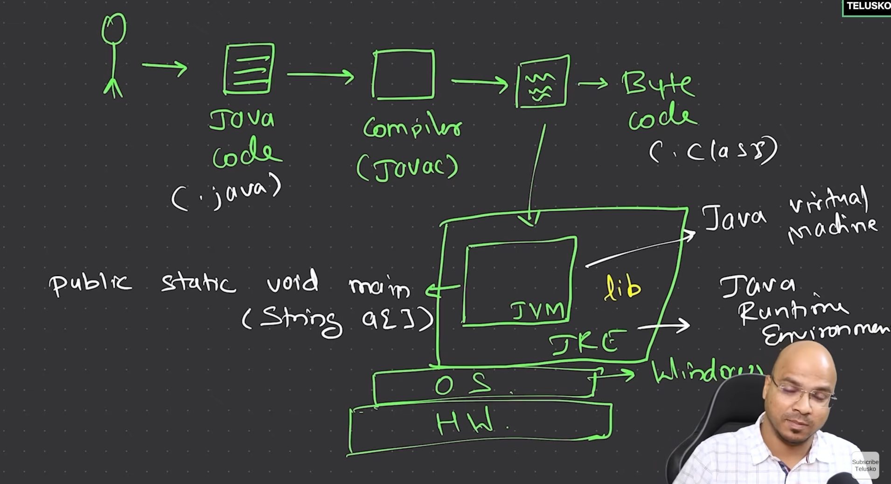
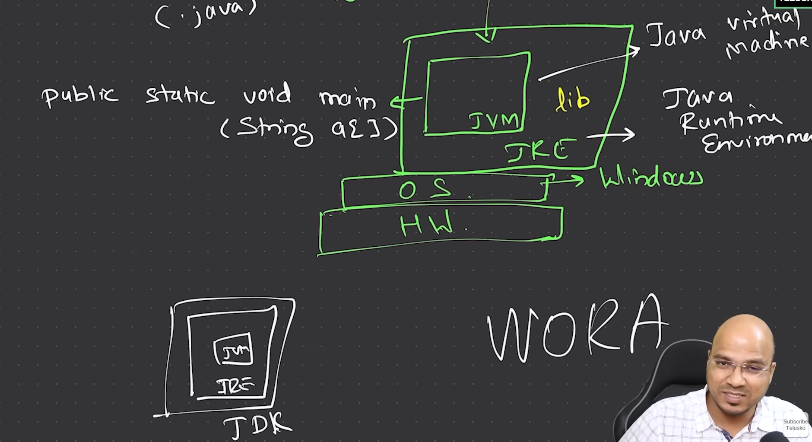

# Lecture 1 of telusko.

## We have installed the IDE and will try to write our first program.

We can check if required software are installed on our server by checking them in this way.


THis is required to run java binary file.
`java --version`

This is required to compile java source code into binary.
`javac --version`

In java9 Jshell was intruduced.

We can write this in terminal.
`jshell`

We can exit jshell by typing this.
`/exit`




# Understanding Java: Platform Independence and How It Works

Java is a **platform-independent** language, which means it can run on any operating system. This capability is made possible by the **Java Virtual Machine (JVM)**, which creates a virtual layer on top of the operating system to run bytecode.

### How Java Works

1. **Source Code to Bytecode**  
   As a programmer, we write the source code in Java, which is then compiled by the Java compiler (`javac`) into **bytecode**. This bytecode is what the JVM understands and executes.

2. **Main Execution File**  
   Among the hundreds or thousands of files in a Java project, there must be a single entry point from where execution begins. This entry point is defined by the following signature:
   
   ```java
   public static void main(String[] args) {}


