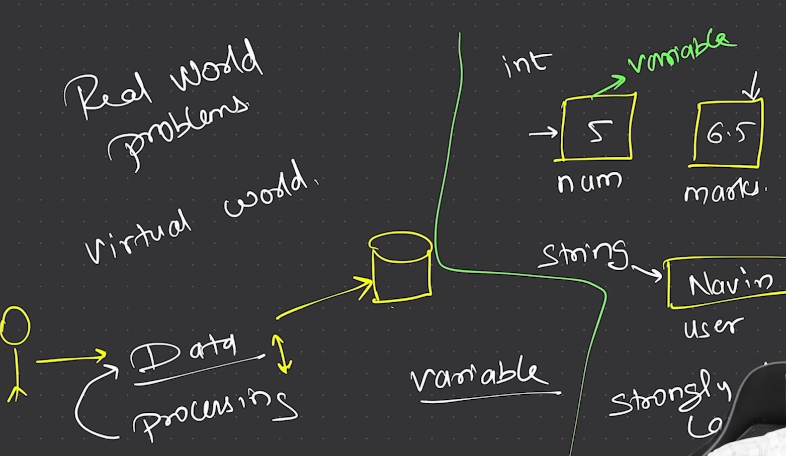

# Lecture 2: Variables in java.

Programming is essentially used to solve real-world problems with the help of the virtual world.

We use variables to temporarily store values for computation, while permanent storage of data is managed using databases. In Java, there are several types of variables. Moreover, Java is a strongly-typed language, which means we must explicitly specify the type of data we want to store. 

