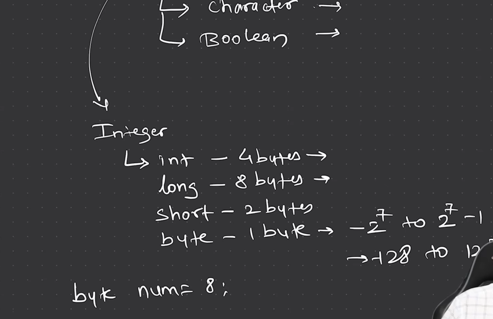

# Lecture 3 Datatypes!

For now we are only talking about primitive datatypes in java and later we will talk about other datatypes that are available.
  

  

First of all we can see these are the types of integers.

  

  

Secondly we can see that we can use floats in this way. One thing that we have to note is that bydefault java treats all value with decimal as double, so whenever we have to declear float we have to type f at the explicitly as mentioned in the screenshot as well.

  

  

Thirdly we can see, we can easily declear char and boolean as well. 
- In java we have to take care that only `true` and `false` can be boolean value and it do not treat 0 and 1 as boolean.
- secondly we have to make sure that we only use single quotes while declearing character as it gives error with double quotes.

  

