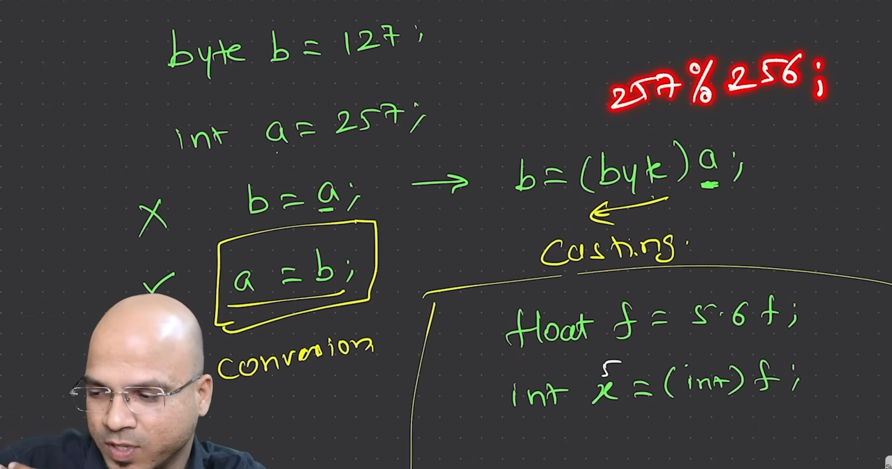

# Lecture 5: Typecasting | converstions| Typepromotion

Unfortunately in java we can not change type of variable, however we can assign value of variable of one type to another via typecasting.

For example, we have a variable of int having 12.

int b = 12;

int c = 257; // for better demonstration

Now whether this integer is in range of byte or not we can not directly assign this variable to integer variable, but if we really want we can do that via typecasting.

byte a = (byte) b; 

value 12 will be assigned to variable a with type as byte.

But if we try to do that with variable c in that case, first comiler will take moduls of the value with range of type and then assign.

As we know range of byte = 256

byte d = (byte) c; 257/256 = 1

so d will be assigned 1, and this is how type casting wil work.

Moreover if we are assiging value from type which has less range to a type of variable who has longer range then there is no issue.

For example we can easily assign any byte value to int without and explict conversion (explict conversion also known as typecasting), and here implicit conversion will happen means nothing to mention.

  

  

## type promotion.

If we have two variables of byte a and b.

byte a = 10;
byte b = 20;

int c = a*b;

Now despite a and b are of type byte and as compiler sees the output is out of range of byte it automatically promotes type of output and this is called type promotion.

**Important**
One more thing to note is that in newer version of java means above 14, we can directly run code.java file we not need to explicitly compile. however the restrictions are we should only do this when we have only one java file, moreover this is not industry standard so we should know this but also we should keep in mind in industry it is very important to compilte the code first.

